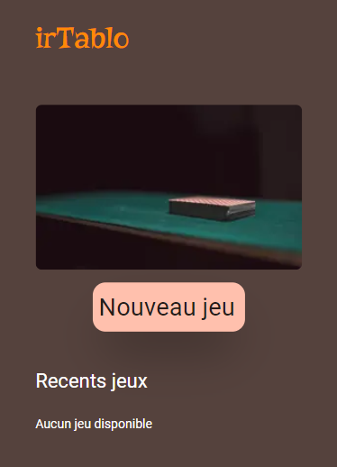
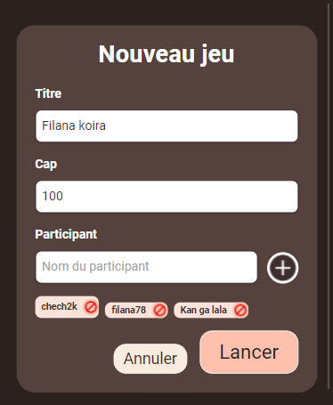
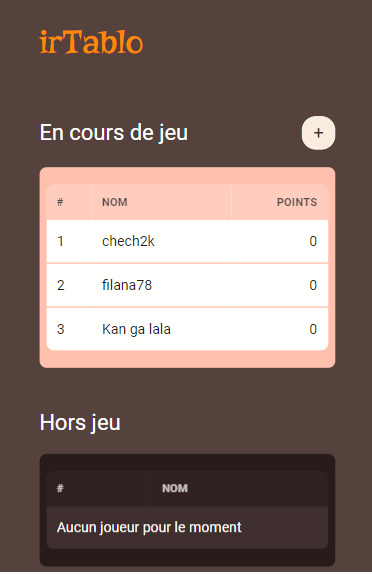
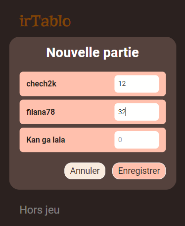
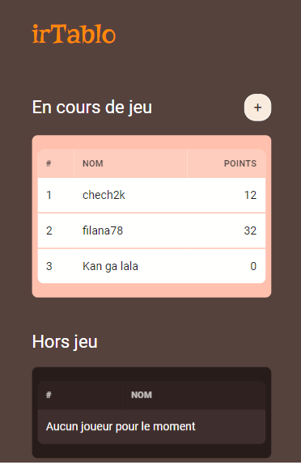

# irTablo

irTablo is an app to record cards points quickly in a game (No need for a pen and paper).

This is the client code for irTablo.
This is a [Next.js](https://nextjs.org/) project bootstrapped with [`create-next-app`](https://github.com/vercel/next.js/tree/canary/packages/create-next-app).

## Installation

Clone the project

```bash
  git clone https://github.com/smiletondi/irtablo
```

Go to the /client directory

```bash
  cd irtablo/client
```

Install dependencies with npm or yarn

```bash
  npm install
  # or
  yarn install
```

Start the server

```bash
  npm run dev
  # or
  yarn dev
```

## Screenshots

### Home page



### New game modal

)

### Game page

)

### New Round modal

)

### After

)

## Authors

- [@smiletondi](https://www.github.com/smiletondi)
- [Ismael Tondi](https://www.linkedin.com/in/smiletondi)

## License

[MIT](https://choosealicense.com/licenses/mit/)
