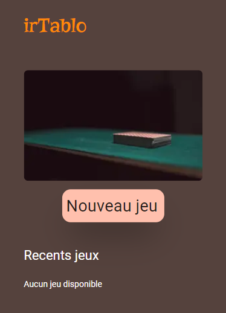
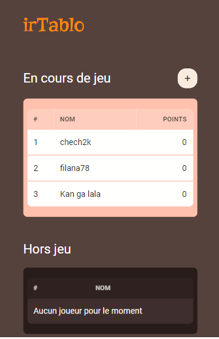
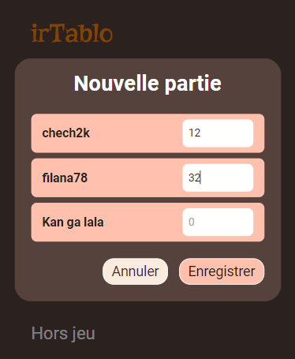
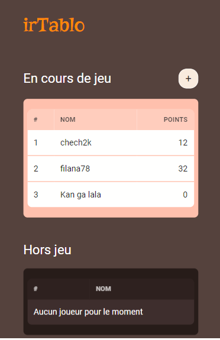

# irTablo

irTablo is an app to record cards points quickly in a game (No need for a pen and paper).

## Installation

Clone the project

```bash
  git clone https://github.com/smiletondi/irtablo
```

### Go to the /client directory

```bash
  cd irtablo/client
```

Install dependencies with npm or yarn

```bash
  npm install
  # or
  yarn install
```

Start the server

```bash
  npm run dev
  # or
  yarn dev
```

### Go to the /server directory

```bash
  cd irtablo/server
```

Install dependencies with npm or yarn

```bash
  npm install
  # or
  yarn install
```

Start the server

```bash
  npm run dev
  # or
  yarn dev
```

## Screenshots



### New game modal

)

### Game page

)

### New Round modal

)

### After

)

## Lessons Learned

This is my first Hacktoberfest challenge and i learned a lot.
These technologies are very interesting and i'm excited to use them in more projects.

1. [CLoudflare Workers](https://developers.cloudflare.com/workers/)
1. [Workers KV](https://developers.cloudflare.com/workers/runtime-apis/kv)
1. [Cloudflare tunnels](https://developers.cloudflare.com/cloudflare-one/connections/connect-apps)
1. [Miniflare](https://miniflare.dev/)

I wish i could built the server with [Durable Objects](https://developers.cloudflare.com/workers/runtime-apis/durable-objects) (too lazy ).
It would be Epic. Feel free to create a ticket if you wanna work on that.

## Authors

- [@smiletondi](https://www.github.com/smiletondi)
- [Ismael Tondi](https://www.linkedin.com/in/smiletondi)

## License

[MIT](https://choosealicense.com/licenses/mit/)
